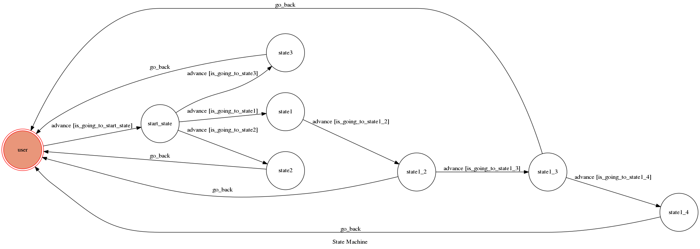

# Alphacat_bot beta version

A telegram bot based on a finite state machine

it can play Rock-Paper-Scissors with you

#### those amazing things write in method and intro are not implement yet, please wait for formal edition  

##How to exe?
```sh
run ngrok change URL

python3 app.py
```


## introduction
The initial state is set to `user`.

type 'hi'(''not include) go to `start state` 
every time when an instruction in `start state` is completed, it will back to user state
you have to type 'hi' again to wake the bot up
and there will have more information and instruction about this bot
the Rock-Paper-Scissors game have to type in chinese'剪刀 石頭 布'


## Finite State Machine

